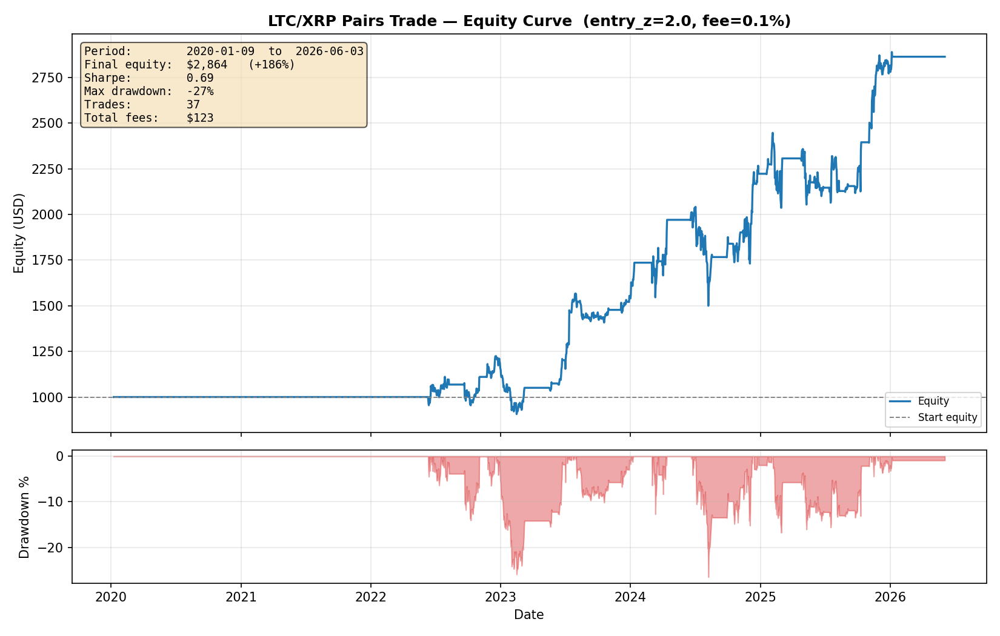
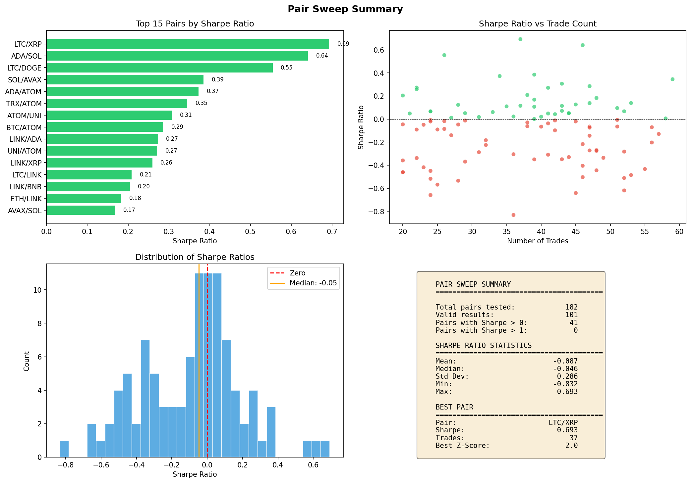

# Jansen Method Pair Trading

This project implements a pairs trading strategy inspired by the book "Machine Learning for Algorithmic Trading" from Stefan Jansen. It utilizes Kalman filtering to smooth price series and estimate a time-varying hedge ratio. A z-score is built from the resulting spread, and trades are executed when the z-score crosses defined thresholds.

## Features

- **Kalman Filter Smoothing**: Reduces noise in individual price series.
- **Dynamic Hedge Ratio**: Uses a Kalman Filter to estimate the cointegration relationship between two assets in real-time.
- **Mean Reversion Strategy**: Trades the z-score of the spread, entering at `entry_z` and exiting when the z-score changes sign (mean reversion). Signals are executed on the **next bar** to avoid look-ahead bias.
- **Rolling Windows**: Recomputes hedge ratio/half-life/z-score quarterly, trades a 6-month window, only opens trades in the first 3 months, and force-closes any position still open at the window end. Periods whose spread is not mean-reverting (non-negative half-life regression) are skipped.
- **Bounded Position Sizing**: Both legs are sized by the gross notional of one spread unit, so long/short are symmetric and leverage stays bounded for any hedge ratio.
- **Risk Management**: Configurable stop-loss via `risk_limit` — measured as P&L relative to the position's gross notional (default -20%).
- **Optimization Tools**: Scripts to sweep z-score thresholds and rank the best-performing pairs; `pair_sweep.py` runs in parallel via `--workers`.
- **Caching**: `pair_sweep.py` uses a signature-based caching mechanism to speed up repeated runs.
- **Unit Tests**: Test suite for backtest logic validation.

## Example Output

Best pair from the sweep — **LTC/XRP** (`entry_z = 2.0`): **+186%** over 2020–2026, **Sharpe 0.69**, **max drawdown −27%** (net of 0.1% fees).



Pair-ranking summary across all tested pairs:



## Scripts

### 1. `jansen_backtest.py`
The core backtest engine for a single pair.
```powershell
python jansen_backtest.py
```
It reads `symbol_x` and `symbol_y` from `config.json`, runs the backtest, and saves the results/plots to the `output/` directory.
The backtest recalibrates quarterly using a rolling lookback window.

**Outputs:**
- `output/equity_{Y}_{X}.png` - Equity curve plot
- `output/jansen_backtest_{Y}_{X}.feather` - Daily backtest results

### 2. `zscore_sweep.py`
Sweeps a grid of z-score thresholds for the pair defined in `config.json`.
```powershell
python zscore_sweep.py --thresholds "1.0,1.5,2.0,2.5,3.0"
```
Useful for finding the optimal entry threshold for a specific pair. It filters results based on `min_trades` and ranks them by `sharpe` ratio.

### 3. `pair_sweep.py`
Ranks all possible pairs from the available data based on their performance.
```powershell
python pair_sweep.py --workers 8
```
- It filters symbols based on `min_history_days`.
- It tests each pair against the `threshold_grid` defined in `config.json` (both directions `(A,B)` and `(B,A)` when `test_both_directions` is true).
- `--workers N` fans the sweep out across N worker processes (default `1` = serial); `--thresholds "1.0,1.5,2.0"` overrides the grid.
- Results are cached in the `cache/` folder using a SHA-256 signature of the data and code (editing any source file invalidates the cache, forcing a clean recompute).

**Outputs:**
- `output/pair_rankings.csv` - Ranked results table with Sharpe, trades, best z-score
- `output/pair_sweep_summary.png` - Summary visualization with:
  - Top pairs bar chart (by Sharpe ratio)
  - Sharpe vs trade count scatter plot
  - Sharpe ratio distribution histogram
  - Summary statistics panel
- `output/equity_{Y}_{X}_z{Z}.png` - Equity curve for the top-ranked pair (includes z-score in filename)

### 4. `download_data.py`
Downloads historical klines data from Binance Futures API.
```powershell
python download_data.py
```
- Reads the `symbols` list from `config.json` and downloads data for each symbol.
- Supports incremental updates (only fetches new data since last download).
- Saves data in Feather format to `feather_dir`.

**Override symbols via CLI:**
```powershell
python download_data.py --symbols BTCUSDT ETHUSDT BNBUSDT
```

## Configuration (`config.json`)

| Parameter | Description | Default |
|-----------|-------------|---------|
| `data_dir` | Path to directory containing `.feather` price files | `data/feather` |
| `feather_dir` | Path for `download_data.py` to save downloaded data | `data/feather` |
| `output_dir` | Path where backtest results and plots are saved | `output` |
| `interval` | Candle interval (e.g., `1d`) | `1d` |
| `quote` | Quote currency (e.g., `USDT`) | `USDT` |
| `symbols` | List of symbols to download (e.g., `["BTC", "ETH"]`) | `[]` |
| `symbol_y` | Primary symbol (Lead) for single-pair backtest | - |
| `symbol_x` | Secondary symbol (Lag/Hedge) for single-pair backtest | - |
| `start_equity` | Initial capital | `1000.0` |
| `entry_z` | Z-score threshold for entering a trade | `2.0` |
| `risk_limit` | Stop-loss trigger as P&L fraction of the position's gross notional (e.g., `-0.2` = -20%) | `-0.2` |
| `threshold_grid` | List of z-score thresholds to test in sweep scripts | `[1.0, 1.5, 2.0, 2.5, 3.0]` |
| `min_history_days` | Minimum data points required for a symbol in `pair_sweep.py` | `1000` |
| `min_trades` | Minimum trades required for a valid backtest result | `20` |
| `test_both_directions` | In `pair_sweep.py`, test both `(A,B)` and `(B,A)` (order matters: `symbol_y` is the regression-dependent series). Roughly doubles runtime. | `true` |
| `workers` | Parallel worker processes for `pair_sweep.py` (CLI `--workers` overrides this) | `1` |
| `fee_rate` | Transaction fee rate (e.g., `0.001` for 0.1%) | `0.001` |
| `lookback_days` | Rolling lookback (in days) before each quarterly test window | `730` |
| `trade_window_months` | Months traded after each quarterly test end | `6` |
| `entry_window_months` | Months within trading window where entries are allowed | `3` |
| `show_plot` | Toggle display of equity curve window | `true` |
| `binance_base_url` | Binance API base URL for data download | `https://fapi.binance.com` |
| `max_klines_per_request` | Max candles per API request | `1500` |
| `kalman.smoother_obs_cov` | Kalman smoother observation covariance | `1.0` |
| `kalman.smoother_trans_cov` | Kalman smoother transition covariance | `0.05` |
| `kalman.hedge_delta` | Kalman hedge ratio delta parameter | `0.001` |
| `kalman.hedge_obs_cov` | Kalman hedge ratio observation covariance | `2.0` |

## Installation

Requires **Python 3.10+** (the code uses `X | None` type-hint syntax).

Install the dependencies:

```powershell
pip install -r requirements.txt
```

(equivalently: `pip install pandas numpy pykalman matplotlib pyarrow requests`)

The data files should be in Feather format with a `close` price column and an `open_time_dt` datetime column.
Files should be named following the pattern `{symbol}{quote}_{interval}.feather` (e.g., `BNBUSDT_1d.feather`).

## Testing

Run the unit tests with:

```powershell
python -m unittest tests.test_backtest_logic -v
```

Or discover all tests:

```powershell
python -m unittest discover -s tests -v
```

## Project Structure

```
Pair_Trading_Jansen/
├── jansen_backtest.py      # Core backtest engine
├── utils.py                # Shared utilities and helpers
├── pair_sweep.py           # Brute-force pair ranking
├── zscore_sweep.py         # Z-score threshold optimization
├── download_data.py        # Binance data downloader
├── config.json             # Configuration file
├── requirements.txt        # Python dependencies
├── tests/
│   ├── __init__.py
│   └── test_backtest_logic.py
├── data/feather/           # Price data (not tracked in git)
├── cache/                  # Cached results (not tracked in git)
├── output/                 # Backtest results and plots (not tracked in git)
└── 06_*.ipynb, 07_*.ipynb  # Reference notebooks from ML4Trading
```
